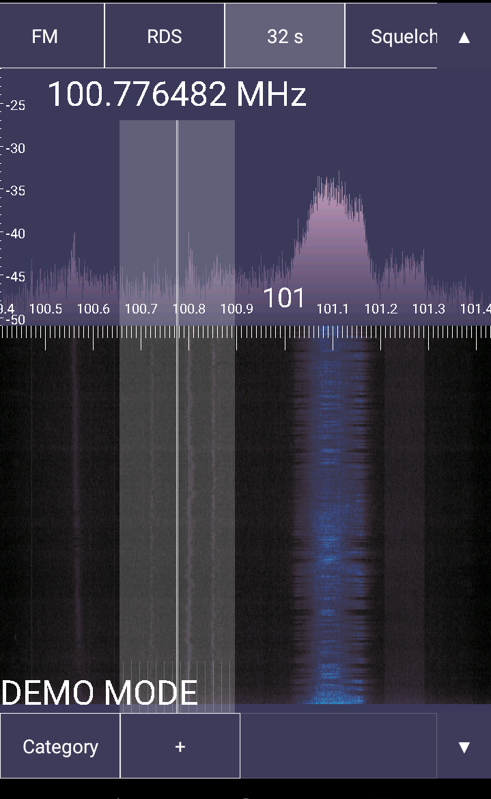

BUG TO FIX: rtltcp clients expect a special header to be sent before anything else.  This header is sent by my soapytcp repo but not this repo.  I need to add the following to the top of the code: "tuner_number = 5 # R820T; tuner_gains = 29 # R820T; dongle_info = struct.pack('>4sII', b'RTL0', tuner_number, tuner_gains)" and then add "conn.sendall(dongle_info)" after "self.open_conn(conn, client_address)".  Not doing this causes for example HDSDR to fail when using another Extio besides mine.

osmotcp.py
==========

This repo provides a Python 2.7 gnuradio script named osmotcp.py.
The script serves samples from any gr-osmosdr supported device
over TCP/IP.  The server supports the RTL\_TCP protocol.  In addition
the output stream can be configured to send either signed words or floating point
IQ samples -- not just the default unsigned byte IQ samples of RTL\_TCP.

Usage for osmotcp.py is as follow: 

    $ python osmotcp.py -h

    usage: osmotcp.py [-h] [--args ARGS] [--freq FREQ] [--rate RATE] [--corr CORR]
                      [--gain GAIN] [--auto] [--word] [--left] [--float]
                      [--host HOST] [--port PORT] [--output OUTPUT]

    optional arguments:
      -h, --help       show this help message and exit
      --args ARGS      device arguments
      --freq FREQ      center frequency (Hz)
      --rate RATE      sample rate (Hz)
      --corr CORR      freq correction (ppm)
      --gain GAIN      gain (dB)
      --peak       show peak values in dBFS
      --auto           turn on automatic gain
      --word           signed word samples
      --left           left justified unsigned byte samples
      --float          32-bit float samples
      --host HOST      host address
      --port PORT      port address
      --output OUTPUT  output file to save 32-bit float samples

Use the --output option to save raw 32bit float samples to a file while serving.

By default the TCP server stream 8 bit unsigned samples.
Use the --word or --float option to serve 16 bit IQ integers or 32 bit
IQ floats instead.

The --left option multiplies the raw 32 bit samples by 256 before serving.  
This option is useful with the airspyhf+.

Use --peak to print peak VU meter information to stderr.

Here is screenshot of SDRTouch connected to osmotcp serving
samples from "rtl=0"

- Copyright 2018 (c) roseengineering
